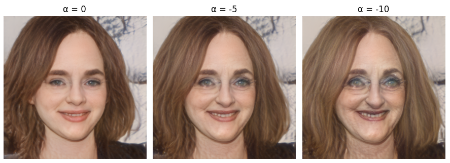
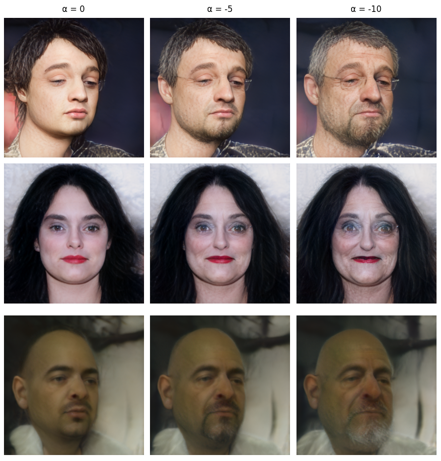

# Face Aging using Latent Direction Vectors

A deep learning project for facial age transformation using GAN latent-space manipulation and direction vectors.

<div align="center">
  
  <p><b>Figure 1:</b> Facial age progression generated using controllable age coefficients.</p>
</div>

---

## Overview

This project performs facial aging by manipulating latent vectors generated from a pretrained GAN model.  
The system uses age direction vectors combined with gender correction vectors to generate more realistic age transformations while preserving facial identity.

The project supports controllable aging intensity using a coefficient parameter:

- `α = 0` → no aging
- `α = -5` → older appearance
- `α = -10` → very old appearance

Positive values can also be used for rejuvenation.

---

## Model & Resources

### Model
- [StyleGAN Inversion](https://github.com/eladrich/pixel2style2pixel) — Used to project real facial images into the StyleGAN latent space for controllable editing.

### Input Source
- [CelebA dataset](https://www.kaggle.com/datasets/jessicali9530/celeba-dataset) — Large-scale celebrity face dataset used for testing and facial image inputs.

### Latent Directions
- [Latent Directions](https://github.com/a312863063/generators-with-stylegan2/raw/master/latent_directions) — Precomputed semantic direction vectors for manipulating facial attributes such as age and gender.
  
---

## Method

The image is first projected into latent space:

$$
w = Encoder(x)
$$

A naive aging process would use only the age direction vector:

$$
w_{aged} = w + \alpha v_{age}
$$

However, this produces unrealistic results because the model learned a dataset bias:
older faces in the training data are predominantly male.

As a result, increasing age also unintentionally increases masculine facial features.

To reduce this effect, a gender direction vector is introduced.

The gender similarity is estimated using cosine similarity:

$$
s = \cos(w, v_{gender})
$$

The final corrected transformation becomes:

$$
w' = w + \alpha \left( v_{age} - \lambda s v_{gender} \right)
$$

Where:

- $v_{age}$ → age direction vector  
- $v_{gender}$ → gender direction vector  
- $\alpha$ → aging coefficient  
- $\lambda$ → masculinity correction strength  

Using positive values of $\alpha$ performs rejuvenation, while negative values perform aging.

---

## Pipeline

```text
Input Image
     ↓
Latent Projection
     ↓
Age Vector Manipulation
     ↓
Gender Bias Correction
     ↓
Modified Latent Vector
     ↓
GAN Generator
     ↓
Output Aged Face
```

---

## Sample Results

Each output row contains:

1. `α = 0` → original image  
2. `α = -5` → aged image  
3. `α = -10` → heavily aged image  

<div align="center">
  
  <p><b>Figure 2:</b> Progressive facial aging results.</p>
</div>

---

## Future Work

Some images are not perfectly frontal, which reduces aging quality and latent consistency.

A future improvement would be integrating the frontalization module provided in the original model repository before latent projection.

This would improve:
- facial alignment
- age consistency
- transformation quality

---
**Course:** Deep Learning    
**University:** Amirkabir University of Technology    
**Semester:** Fall 2025    
**Author:** Hadi Salavati
